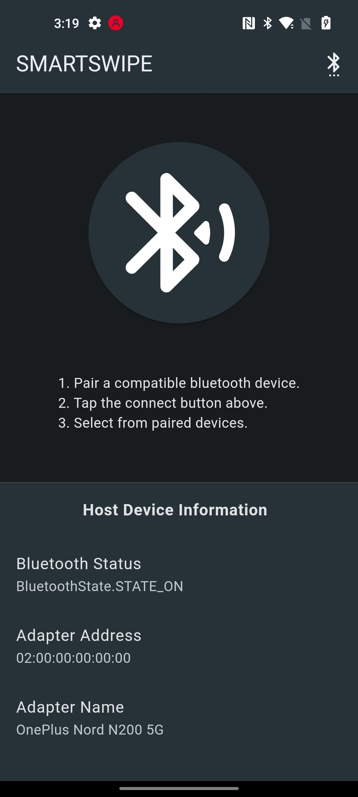
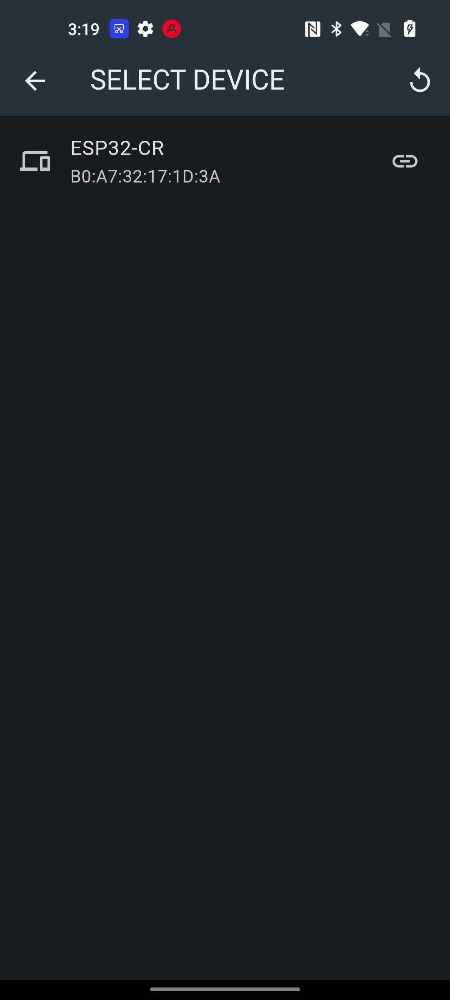
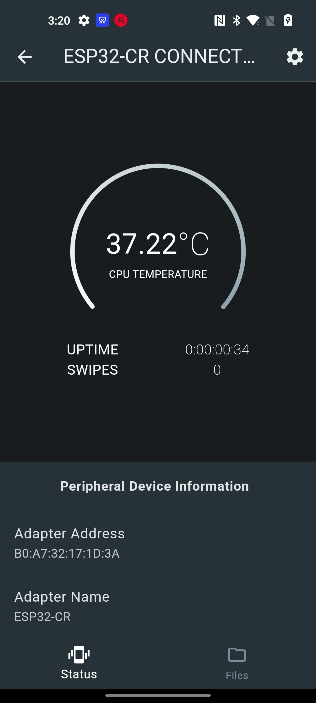
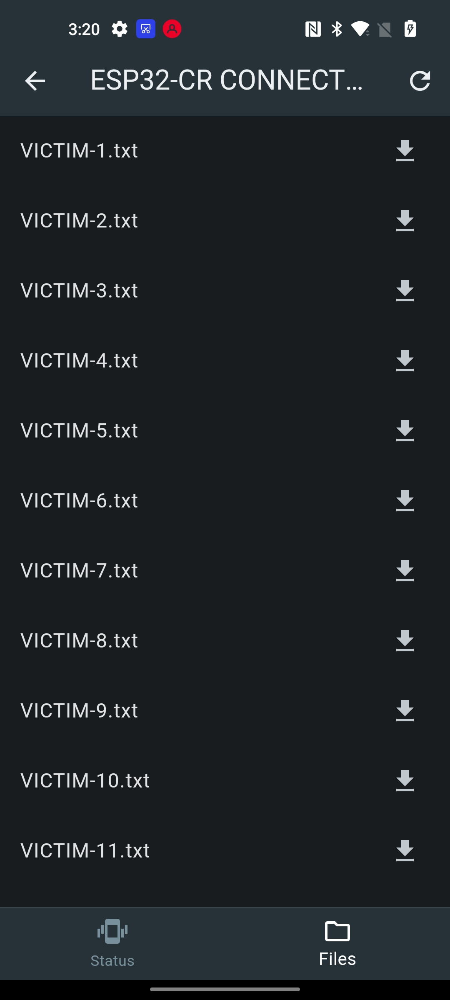
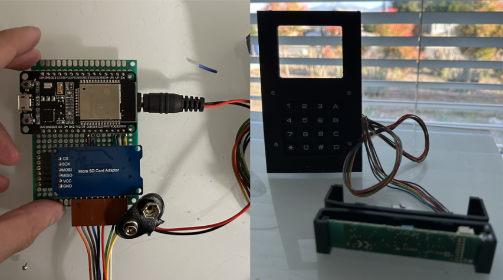

# Smartswipe

   

This is a companion app to a ESP-32 based credit card skimmer device with bluetooth functionality. 

## Getting Started

The smartswipe app will only function correctly when hardware and software of the peripheral device (ESP-32) is configured according to the companion project below. Read the documentation that details the hardware specifications of the peripheral device in the link below.

https://github.com/nk2e3/ESP32-Flutter-Bluetooth-Card-Skimmer
