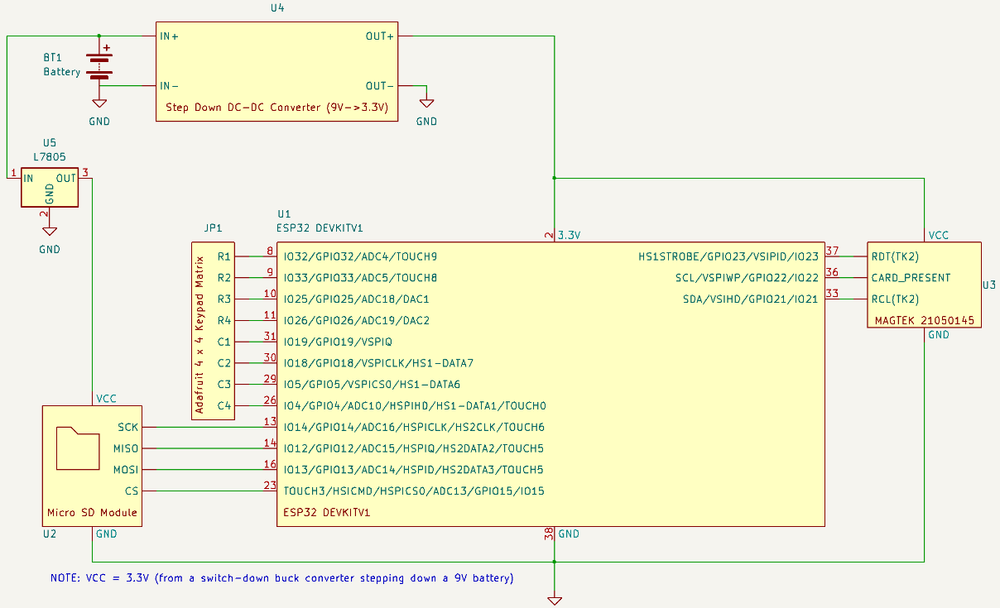

# Smartswipe

Connect Page               |  Select Page              |  Status Page              |  File Explorer          
:-------------------------:|:-------------------------:|:-------------------------:|:-------------------------:
  |  |   |  

This is a companion app to a ESP-32 based credit card skimmer device with bluetooth functionality. 

## Getting Started
The smartswipe app will only function correctly when hardware and software of the peripheral device (ESP-32) is configured according to the companion project below. Read the documentation that details the hardware specifications below. After the hardware is assembled accordingly, the ESP-32 can then be loaded with the code from the following link below.

https://github.com/nk2e3/ESP32-Flutter-Bluetooth-Card-Skimmer

